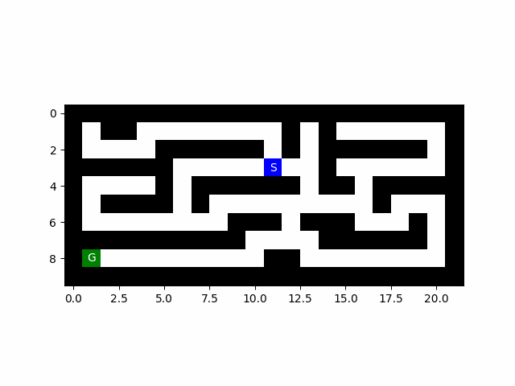
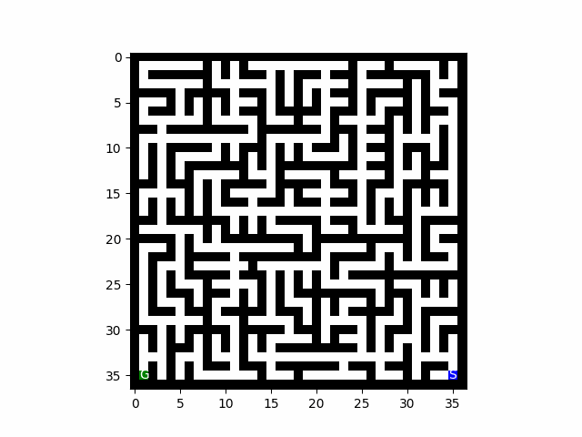
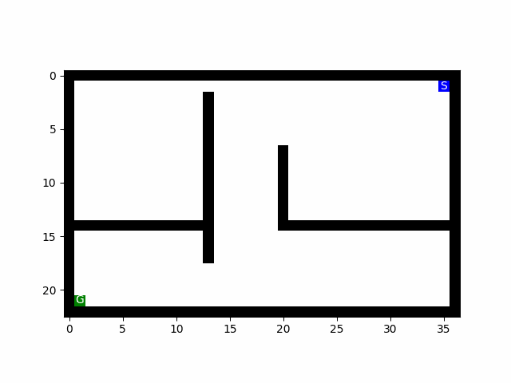
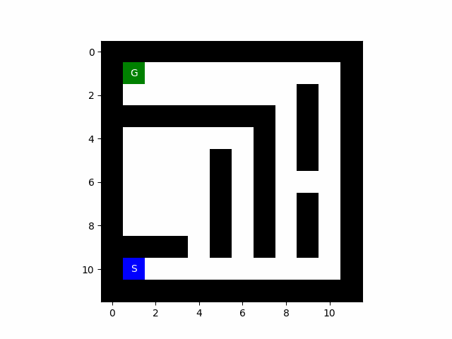
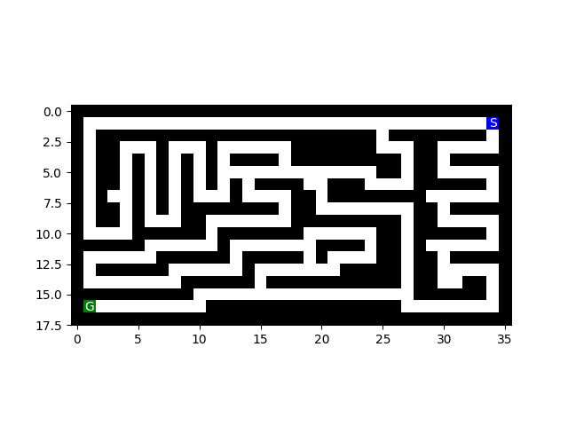

# AI_Maze_Visualizer
## Intro
This repository serves as a tutorial on how to use my `animate_maze()`
You might need to install ffmpeg or Pillow on your system in order to write to a gif file (tutorials are available online)
## Functions available
### `paint_path(path,maze,value)`
This function will paint the maze passed into it (NOTE THIS IS DONE IN PLACE NOT ON A COPY (PASS BY REFERENCE MAZE)) and accepts several things:
- `path`: a list of tuples where the tuples are the (x,y) value of the node in any given path
    - Meaning if we wanted to paint a path between (0,0) and (5,0), we would pass `[(0,0),(0,1),(0,2),(0,3),(0,4),(0,5)]`
    - This would result in a horizontal line being painted on our maze
    - NOTE: this will overwrite walls if you let it
- `maze`: a 2d numpy array representing the maze
    - This is the same thing that is returned by Dr. Hahsler's `parse_maze()` function
- `value`: This is the character that you wish to paint on the path
    - `'.'` is used for the visited data structure
    - `'F'` is used for the frontier data structure
    - `'P'` is used for the final path of start->goal
### `animate_maze(mazes, fileName=None,repeat = False,goal_show_frames=5)`
This function is for animimating a series of mazes into a gif file and saving it off and accepts several parameters:
- `mazes`: a list of numpy arrays showing the painted mazes
- `fileName (optional)`: filepath to save the gif to (should end in .gif to view properly)
- `repeat`: Boolean about whether or not to loop the animation that is returned
- `goal_show_frames (optional)`: int that describes how many frames to hold the last frame (leaving default is probably fine)
## Additional Notes:
There is an example ipynb file included in this repo to show how to write all of the code and get it working together. Please feel free to reach out to my smu email address if you have any questions about using this
## Results

